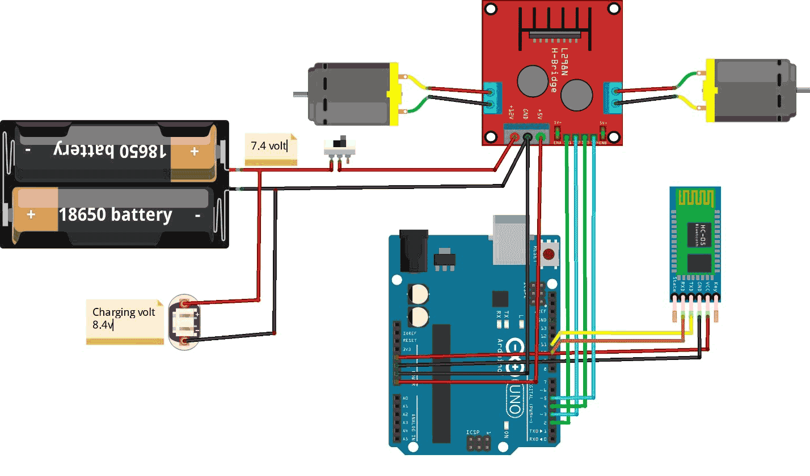

# Bluetooth-Controlled Robot Car with Arduino

This project demonstrates a simple Bluetooth-controlled robot car using an Arduino Uno, an HC-05 Bluetooth module, and an L298N motor driver to control two DC motors.

---

## **Project Overview**

This robot car responds to Bluetooth commands sent from a smartphone or any other Bluetooth-enabled device. The commands are processed by the Arduino Uno, which controls the motors through the L298N motor driver to perform various movements like forward, backward, left, right, and stop.

---

## **Features**

- Wireless control via Bluetooth
- Supports the following commands:
  - **F**: Move Forward
  - **B**: Move Backward
  - **L**: Turn Left
  - **R**: Turn Right
  - **S**: Stop
- Easy-to-build circuit with commonly available components.

---

## **Hardware Requirements**

- **Arduino Uno**: Acts as the main controller.
- **HC-05 Bluetooth Module**: Provides wireless communication with the robot.
- **L298N Motor Driver**: Drives the DC motors.
- **Two DC Motors**: Used for the movement of the robot.
- **18650 Batteries (7.4V)**: Power source for the motors.
- **Switch**: Controls power to the circuit.
- **Jumper Wires**: For connecting components.

---

## **Circuit Diagram**

---

## **Connections**

### Arduino to Motor Driver:
| **Arduino Pins** | **L298N Pins** |
|-------------------|----------------|
| D2               | IN1            |
| D3               | IN2            |
| D4               | IN3            |
| D5               | IN4            |

### Arduino to Bluetooth Module:
| **Arduino Pins** | **HC-05 Pins** |
|-------------------|----------------|
| D10 (TX)         | RX             |
| D11 (RX)         | TX             |
| 3.3V             | VCC            |
| GND              | GND            |

### Power Supply:
- **Motors**: Powered by 7.4V (18650 battery pack).
- **Arduino**: Powered via USB or an external 9V battery.

---

## **Software Requirements**

- **Arduino IDE** (Version 1.8 or later)

---

## **Getting Started**

1. **Assemble the Hardware**:
   - Connect the components as shown in the circuit diagram.

2. **Upload the Code**:
   - Open the `BluetoothRobot.ino` file in the Arduino IDE.
   - Select the correct board and port from the **Tools** menu.
   - Upload the code to the Arduino Uno.

3. **Pair the Bluetooth Module**:
   - Pair the HC-05 module with your smartphone. Default pairing code: `1234` or `0000`.

4. **Control the Robot**:
   - Use a Bluetooth terminal app to send commands (`F`, `B`, `L`, `R`, `S`) to the robot.
   - Observe the robot's movement as it responds to the commands.

---

## **Code Explanation**

The Arduino code uses the `SoftwareSerial` library to communicate with the HC-05 Bluetooth module. The received Bluetooth commands are processed to control the direction and behavior of the motors using the L298N motor driver.

### **Commands and Actions**
| **Command** | **Action**   |
|-------------|--------------|
| `F`         | Move Forward |
| `B`         | Move Backward|
| `L`         | Turn Left    |
| `R`         | Turn Right   |
| `S`         | Stop         |

Each action is implemented using dedicated functions (`forward()`, `reverse()`, `left()`, `right()`, and `stopRobot()`), which control the motor states through the L298N.

---

## **Improvements and Additions**

- Add **speed control** by connecting the ENA and ENB pins on the L298N to PWM-enabled pins on the Arduino.
- Implement **obstacle detection** using ultrasonic sensors.
- Introduce a **battery monitoring system** to track power levels.

---

## **License**

This project is licensed under the [MIT License](LICENSE).

Feel free to modify and use this project as needed!
